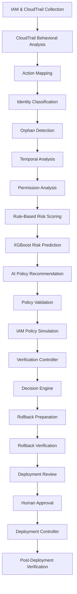
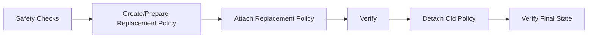
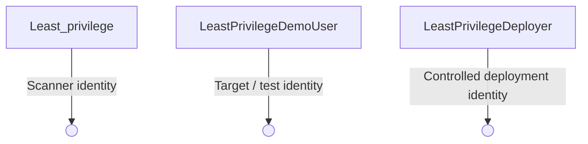
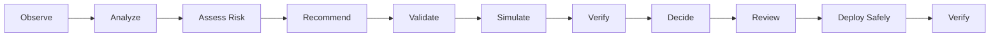

<div align="center">

# 🔐 Cloud Least Privilege Enforcer

**Automated AWS IAM security analysis and least-privilege enforcement — from real activity to safe, verified remediation.**

[](#)
[](#)
[](#)
[](#)
[](#)
[](#)

</div>

---

An end-to-end pipeline that analyzes real cloud activity, compares it with granted IAM permissions, evaluates identity risk, recommends least-privilege policies, validates and simulates them, and controls remediation through verification, human approval, rollback, and deployment safety mechanisms — **never modifying IAM permissions on trust alone.**

## 📑 Table of Contents

- [Overview](#-overview)
- [Main Objective](#-main-objective)
- [System Workflow](#-system-workflow)
- [Key Features](#-key-features)
- [Project Structure](#-project-structure)
- [Technologies Used](#-technologies-used)
- [AWS Demonstration Setup](#-aws-demonstration-setup)
- [CloudTrail Configuration](#-cloudtrail-configuration)
- [Installation and Setup](#-installation-and-setup)
- [Demonstration Test](#-demonstration-test)
- [Running Individual Modules](#-running-individual-modules)
- [Complete Pipeline](#-complete-pipeline)
- [Safety Design](#-safety-design)
- [Example Demonstration Scenario](#-example-demonstration-scenario)
- [Important Terminology](#-important-terminology)
- [Current Demonstration Mode](#-current-demonstration-mode)
- [Expected Outputs](#-expected-outputs)
- [Project Outcome](#-project-outcome)
- [Disclaimer](#-disclaimer)

---

## 🧭 Overview

The **Cloud Least Privilege Enforcer** identifies unnecessary or potentially excessive IAM permissions by combining AWS IAM configuration with actual AWS CloudTrail activity — rather than relying on granted permissions alone.

The system considers:

| Signal | Description |
|---|---|
| 🗂️ Granted IAM policies | Permissions currently assigned to an identity |
| 📡 Actual API activity | Real usage recorded by CloudTrail |
| 🔍 Observed IAM actions | Actions mapped from real API calls |
| 🧬 Identity type & classification | User, role, service identity, or unknown |
| 👻 Orphan / inactive status | Identities with little or no recent activity |
| ⏱️ Temporal access behavior | When and how access actually happens |
| ⚠️ Potentially unused permissions | Granted but never observed |
| 🚨 Potentially excessive permissions | Broader than required |
| 📊 Rule-based risk scoring | Transparent, explainable scoring |
| 🤖 XGBoost-based risk prediction | ML-driven identity risk |
| 🧠 AI-assisted policy recommendation | LLM-generated candidate policy |
| ✅ AWS IAM Access Analyzer validation | Independent AWS-native validation |
| 🧪 IAM Policy Simulator testing | Simulated permission checks |
| 🛡️ Pre-deployment verification | Final safety gate before change |
| ⚖️ Decision-based remediation | Only acts when justified |
| ♻️ Rollback preparation & verification | Every change is reversible |
| 🙋 Human deployment approval | A person signs off before AWS changes |
| 🎛️ Controlled deployment | Attach → verify → detach → verify |
| 📋 Post-deployment verification | Confirms the final IAM state |

The project is implemented as a **modular Python pipeline**, integrated with AWS services through **Boto3** and the **AWS CLI**.

## 🎯 Main Objective

> Provide a controlled workflow from **IAM permissions + actual usage** → **risk analysis + least-privilege policy recommendation + validation + controlled remediation.**

The system is deliberately designed so that **AI and machine-learning outputs never directly modify AWS IAM permissions** without validation and safety checks.

## 🔄 System Workflow



## ✨ Key Features

### 1. IAM Policy Scanning
Scans AWS IAM identities and their policies, including IAM users, roles, attached managed policies, inline policies, and policy actions.
📄 Output: `reports/policies.json`

### 2. CloudTrail Activity Collection
Collects actual API activity performed by the target IAM identity via AWS CloudTrail.
**Captures:** username, API event, event time, event source, AWS region, resources.
📄 Output: `reports/cloudtrail_logs.json`

### 3. CloudTrail Behavioral Analysis
Analyzes observed activity for API usage, accessed services, sensitive actions, activity outside the defined access window, and cross-service access.
📄 Output: `reports/cloudtrail_analysis.json`

### 4. Action Mapping
Maps observed AWS API operations to IAM permissions — for example, mapping an observed S3 operation to the corresponding IAM action required by the recommendation process.
📄 Output: `reports/observed_actions.json`

### 5. Identity Classification
Classifies identities (IAM users, IAM roles, AWS service identities, unknown) with confidence information.
📄 Output: `reports/identity_report.json`

### 6. Orphan Detection
Identifies inactive or potentially orphaned identities, reporting activity status, last activity, inactive days, and risk classification.
📄 Output: `reports/orphan_report.json`

### 7. Temporal Analysis
Analyzes *when* activity occurs — activity inside/outside the expected access window, weekend activity, and timestamp validity.
📄 Output: `reports/temporal_report.json`

### 8. Permission Analysis
Compares granted permissions with observed activity to identify potentially unused permissions, potentially excessive policies, and uncovered observed actions.

> ℹ️ Potentially unused permissions are **not** automatically treated as confirmed excessive permissions.

📄 Output: `reports/permission_analysis.json`

### 9. Rule-Based Risk Scoring
Calculates a transparent risk score using factors such as permission risk, usage risk, orphan risk, temporal risk, identity adjustment, potentially unused permissions, and potentially excessive policies.
📄 Output: `reports/risk_report.json`

### 10. XGBoost Risk Prediction
An XGBoost model predicts identity risk from features including permission risk, usage risk, number of services, unusual-hour access, sensitive actions, cross-service access, temporal risk, orphan status, administrative/full-access indicators, policy count, and unused-permission percentage.

> ⚖️ The XGBoost score is a risk *prediction* — not by itself a command to delete or modify IAM permissions.

📄 Output: `reports/ml_risk_predictions.json`

### 11. AI Policy Recommendation
Uses an **Ollama-hosted Llama 3.2 3B** model to generate a candidate least-privilege IAM policy from observed activity, mapped IAM actions, services, and permission analysis.

> 🛡️ Deterministic security guardrails ensure raw LLM output is never blindly trusted.

📄 Output: `reports/ai_recommended_policies.json`

### 12. Policy Validation
Validates the recommended policy using local policy checks and **AWS IAM Access Analyzer**.
📄 Output: `reports/policy_validation_report.json`

### 13. IAM Policy Simulation
Uses the **AWS IAM Policy Simulator** to test whether required IAM actions would be allowed by the recommended policy.
📄 Output: `reports/ai_policy_simulation_report.json`

### 14. Verification Controller
Combines observed CloudTrail actions, IAM action mapping, the recommended policy, Access Analyzer results, and IAM simulation to verify the recommendation before deployment review.
📄 Output: `reports/verification_controller_report.json`

### 15. Decision Engine
Combines rule-based risk, XGBoost risk, permission analysis, policy validation, IAM simulation, and verification status to decide whether remediation is required.

> ⚖️ A higher ML risk score alone does **not** automatically trigger IAM modification.

📄 Output: `reports/decision_engine_report.json`

### 16. Rollback Controller
Creates a snapshot of the target identity's IAM state before any real IAM modification, including identity information, attached managed policies, and inline policies.
📁 Output directory: `reports/rollback/`

### 17. Rollback Verification
Verifies that the rollback snapshot correctly represents the target IAM state.

### 18. Deployment Review
Performs final safety checks before deployment: target identity, verification status, Access Analyzer, IAM simulation, recommended policy, action coverage, AI status, wildcard actions, observed actions, and confirmed excessive permissions.
📄 Output: `reports/deployment_review_report.json`

### 19. Human Deployment Approval
The system can require a human to explicitly approve the proposed deployment. The reviewer sees the target identity, deployment mode, and policy actions before continuing:

```text
============================================================
                 HUMAN DEPLOYMENT APPROVAL
============================================================

Target Identity : LeastPrivilegeDemoUser
Deployment Mode : DRY RUN

Policy Actions:
------------------------------------------------------------
 - s3:ListAllMyBuckets

No AWS changes will be made during DRY RUN.

Type APPROVE to continue or anything else to cancel: APPROVE
```

This provides a **human-in-the-loop safety checkpoint**.

### 20. Deployment Controller
Controls the IAM remediation process:



If deployment fails, rollback can restore the previous IAM state. For demonstrations, keep:

```python
DRY_RUN = True
```

### 21. Post-Deployment Verification
After an actual IAM deployment, checks whether the AWS IAM state matches the expected result. If no deployment occurs, the correct status is `POST-DEPLOYMENT VERIFICATION: NOT_REQUIRED`.

## 🗂️ Project Structure

```text
D:\Least_privilege
│
├── pipeline.py                          # Orchestrates the full workflow
├── scanner/
│   └── iam_scanner.py
├── cloudtrail/
│   ├── collector.py
│   └── analyzer.py
├── cloudtrail_analysis.py
├── action_mapper/
│   └── mapper.py
├── identity/
│   └── classifier.py
├── orphan/
│   └── detector.py
├── temporal/
│   └── analyzer.py
├── least_privilege/
│   └── analyzer.py
├── risk/
│   └── scorer.py
├── ml/
│   ├── train_model.py
│   └── predict_risk.py
├── ai/
│   └── policy_recommender.py
├── validation/
│   ├── policy_validator.py
│   ├── policy_simulator.py
│   ├── verification_controller.py
│   ├── rollback_controller.py
│   ├── rollback_verification.py
│   ├── deployment_review.py
│   ├── deployment_controller.py
│   └── post_deployment_verification.py
├── decision/
│   └── decision_engine.py
├── reports/
│   └── generated JSON reports
└── README.md
```

## 🛠️ Technologies Used

| Technology | Purpose |
|---|---|
| **AWS IAM** | Identity and permission management |
| **AWS CloudTrail** | API activity collection |
| **AWS IAM Access Analyzer** | IAM policy validation and analysis |
| **AWS IAM Policy Simulator** | Permission simulation |
| **Python** | Core application development |
| **Boto3** | Python integration with AWS |
| **AWS CLI** | AWS configuration and testing |
| **XGBoost** | Machine-learning-based risk prediction |
| **Ollama** | Local AI policy recommendation |
| **Llama 3.2 3B** | AI model used for policy recommendation |
| **JSON** | Report and configuration storage |
| **Git / GitHub** | Version control |

## 🧪 AWS Demonstration Setup

Use a dedicated demonstration identity rather than the scanner identity:



> 🔒 **The scanner identity should never be modified by the remediation process.**

For demonstration purposes, policies can be manually attached to `LeastPrivilegeDemoUser`. A narrow policy can represent the expected workload, while broader policies can be temporarily attached to demonstrate potentially unused or excessive access.

## 📡 CloudTrail Configuration

The project requires CloudTrail management events so actual API activity can be analyzed.

**Demonstration trail:** `LeastPrivilegeEnforcerTrail`

After generating test activity with the demonstration identity, the collector retrieves the activity for analysis.

## ⚙️ Installation and Setup

| Step | Command |
|---|---|
| 1. Open the project directory | `cd /d D:\Least_privilege` |
| 2. Verify Python | `python --version` |
| 3. Verify AWS CLI | `aws --version` |
| 4. Verify the AWS profile | `aws sts get-caller-identity --profile leastprivilege` |
| 5. Verify the demonstration profile | `aws sts get-caller-identity --profile leastprivilege-demo` |
| 6. Verify Ollama | Ensure Ollama is installed and the required Llama model is available locally before running the AI recommendation stage |

## 🚀 Demonstration Test

### Generate test activity

Using the dedicated demonstration profile:

```cmd
aws s3api list-buckets --profile leastprivilege-demo
```

Verify the identity:

```cmd
aws sts get-caller-identity --profile leastprivilege-demo
```

### Run the complete pipeline

```cmd
cd /d D:\Least_privilege
python pipeline.py
```

Expected final status:

```text
FINAL PIPELINE STATUS: COMPLETED
```

## 🧩 Running Individual Modules

| Module | Command |
|---|---|
| IAM Scanner | `python scanner\iam_scanner.py` |
| CloudTrail Collector | `python cloudtrail\collector.py` |
| CloudTrail Analyzer | `python cloudtrail\analyzer.py` |
| Behavioral Analysis | `python cloudtrail_analysis.py` |
| Action Mapper | `python action_mapper\mapper.py` |
| Identity Classification | `python identity\classifier.py` |
| Orphan Detection | `python orphan\detector.py` |
| Temporal Analysis | `python temporal\analyzer.py` |
| Permission Analysis | `python least_privilege\analyzer.py` |
| Rule-Based Risk Scoring | `python risk\scorer.py` |
| XGBoost Risk Prediction | `python ml\predict_risk.py` |
| AI Policy Recommendation* | `set PYTHONPATH=D:\Least_privilege && python ai\policy_recommender.py` |
| Policy Validation | `python validation\policy_validator.py` |
| IAM Policy Simulation | `python validation\policy_simulator.py` |
| Verification | `python validation\verification_controller.py` |
| Decision Engine | `python decision\decision_engine.py` |
| Rollback Controller | `python validation\rollback_controller.py` |
| Rollback Verification | `python validation\rollback_verification.py` |
| Deployment Review | `python validation\deployment_review.py` |
| Deployment Controller | `python validation\deployment_controller.py` |
| Post-Deployment Verification | `python validation\post_deployment_verification.py` |

\* The complete pipeline already handles the project-root Python path — the `PYTHONPATH` step is only needed when running this module directly.

## 🏁 Complete Pipeline

Recommended command for the full demonstration:

```cmd
cd /d D:\Least_privilege
python pipeline.py
```

The pipeline executes all project stages sequentially and reports the status of every stage.

## 🛡️ Safety Design

| Mechanism | Guarantee |
|---|---|
| **Scanner protection** | The scanner identity should never be modified by the remediation process |
| **Human approval** | A human approval checkpoint can be required before deployment |
| **Dry-run mode** | `DRY_RUN = True` prevents actual IAM changes during a demonstration |
| **Validation before deployment** | A candidate policy is validated and simulated before deployment |
| **Rollback** | The existing IAM state can be captured before a real deployment so changes can be reversed if required |
| **AI guardrails** | Raw LLM output is not blindly trusted — deterministic checks are applied before a recommendation is accepted |
| **Risk separation** | Rule-based risk and XGBoost risk are maintained as separate signals; an ML risk score alone does not automatically trigger permission deletion |

## 🎬 Example Demonstration Scenario

```text
Target:            LeastPrivilegeDemoUser
Actual workload:   S3
Observed activity: s3:ListBuckets, sts:GetCallerIdentity
```

The system then performs:

1. Scan IAM permissions
2. Collect CloudTrail activity
3. Analyze behavior
4. Map observed actions
5. Classify identity
6. Detect orphan status
7. Analyze temporal activity
8. Compare granted and observed permissions
9. Calculate rule-based risk
10. Predict risk using XGBoost
11. Generate candidate policy using AI
12. Validate policy
13. Simulate policy
14. Verify recommendation
15. Make remediation decision
16. Prepare rollback
17. Review deployment
18. Request human approval
19. Perform controlled deployment/dry run
20. Verify deployment

## 📖 Important Terminology

| Term | Definition |
|---|---|
| **Granted permission** | A permission that the IAM identity currently has |
| **Observed permission** | A permission corresponding to activity actually observed in CloudTrail |
| **Potentially unused permission** | A granted permission not observed during the monitored activity period |
| **Potentially excessive permission** | A permission or policy identified as potentially broader than required |
| **Confirmed excessive permission** | A permission that satisfies the project's remediation criteria |
| **Rule-based risk** | Risk calculated using predefined security rules |
| **XGBoost risk** | Risk predicted by the trained machine-learning model |
| **Recommendation** | A candidate least-privilege policy generated from the analysis |
| **Verification** | A check that the recommendation is structurally valid, analyzable, simulated, and covers required actions |
| **Deployment** | An actual AWS IAM modification — a dry run or human approval does not itself mean a modification occurred |

## 🧯 Current Demonstration Mode

```text
Deployment Mode: DRY RUN
AWS Changes:     FALSE
```

When no confirmed excessive permissions require remediation, the Decision Engine can produce:

```text
NO_REMEDIATION_REQUIRED
```

In this situation, post-deployment verification is correctly reported as:

```text
NOT_REQUIRED
```

because no actual deployment occurred.

## 📦 Expected Outputs

Reports are generated under `reports\`:

```text
policies.json
cloudtrail_logs.json
usage_report.json
cloudtrail_analysis.json
observed_actions.json
identity_report.json
orphan_report.json
temporal_report.json
permission_analysis.json
risk_report.json
ml_risk_predictions.json
ai_recommended_policies.json
policy_validation_report.json
ai_policy_simulation_report.json
verification_controller_report.json
decision_engine_report.json
deployment_review_report.json
deployment_controller_report.json
post_deployment_verification_report.json
```

## 🏆 Project Outcome

The Cloud Least Privilege Enforcer provides an integrated workflow:



The main focus is not simply generating an IAM policy. The system connects **actual cloud behavior**, **permission analysis**, **machine-learning risk prediction**, **AI-assisted recommendation**, **policy validation**, **simulation**, **human oversight**, **rollback preparation**, and **controlled deployment** into one security workflow.

## ⚠️ Disclaimer

This project is intended for **educational, research, and controlled security-testing purposes**.

Use a dedicated AWS test identity/account for demonstrations. **Do not** experiment with broad permissions or automated IAM remediation on production identities without appropriate authorization and safeguards.
